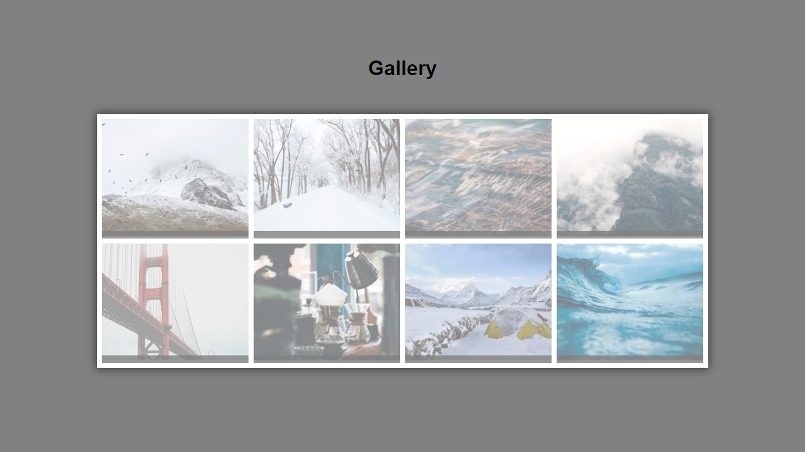

Gallery is a study project focused on 2D transforms using CSS. This project features a photo gallery where I experimented with transformations such as scaling, rotating, and translating elements to create dynamic visual effects. It helped me improve my understanding of CSS transforms and how they can be applied to enhance user interaction and visual presentation.

**[See Page](https://luigineryproject6.netlify.app)**  

